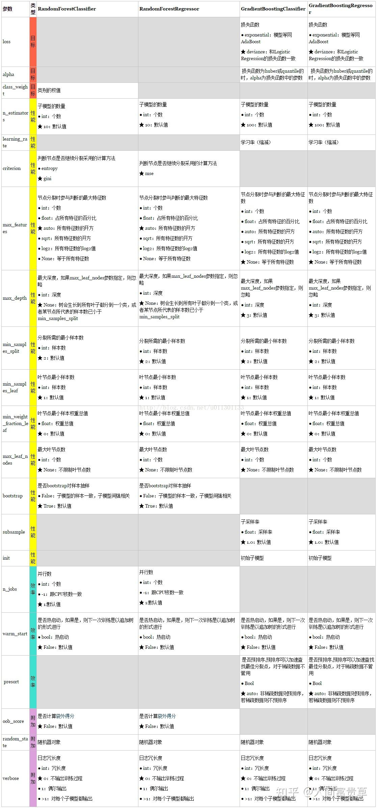

## 一个引入栗子

俗话说得好：三个臭皮匠顶个诸葛亮。

有一天班里测试，考语数外三门学科。学霸很强很全能，三门课都能考95分以上。但是ABC三名偏科学渣不同，他们每人只擅长一门，比如A考语文100分，B数学100分，C外语100分，三人其余两门则都不及格。

为了挫挫学霸的锐气，三人决定联合起来，一同对应这场测试。

A负责做语文的卷子，B负责做数学的卷子，C负责做外语的卷子。最终三人的成绩联合在一起胜过了学霸。

经典案例，以弱博强。

我们接下来要讲的机器学习算法，随机森林，也是如此。

### 随机森林，random forest，是集成学习中的一种典型的bagging算法。

bagging算法可以和其他分类、回归算法结合，提高准确率、稳定性的同时，通过降低结果的方差，来避免o过拟合的发生。

> 给定一个大小为N个样本D个特征(feature)的数据集Dataset, Bagging算法从中均匀、有放回地（即随机抽样法）选出n个样本且每个样本包含d个特征的子集，作为新的训练集。这样重复m次，对于每一次的随机采样，都在子训练集上使用分类、回归等算法，则可得到m个模型。再通过取平均值、取众数等方法，即可得到Bagging的结果。

随机森林，就简单来讲，森林指的是很多个决策树组合在一起，随机则是指随机从数据集中采样来训练模型中的每棵决策树。

随机选取不同的数据集是为了保证每个决策树看待问题的角度不同，以便输出相似但不相同的模型结果，再讲所有决策树结果整合在一起，作为输出结果，而这一训练方式，意味着很难过拟合，并且对噪音不敏感。

### 随机森林的步骤

1. 预设模型的超参数，比如几棵树，每棵树的深度有几层？
2. 随机采样，训练每个决策树，从而保证每棵树看待问题的角度都不一样。样本数量n<<总体数量N，样本特征d<<总体特征D。
3. 输入待测样本到每棵树中，再将每棵树的结果整合在一起：regression：均值，classification：众数。

### 那么随机森林的优缺点有啥？

优点：

* 模型随机性强，不易过拟合；
* 模型抗噪声性强，对异常点outliter不敏感；
* 处理高维数据集相比较快，比决策树更快；
* 树状结构，模型可解释性高，可以体现出每个特征的重要性；

缺点：

* 模型往往过于general，不具备正确处理过于复杂困难样本的能力；

> 这是因为模型对异常点不敏感，随机森林不专注于解决困难样本

* 模型起点高，但天花板低；

> 三个偏科学渣联合在一起可能会战胜学霸，但是对于语数外这三门学科之后的物化生，就应付不了了


### RandomForestClassifier参数详解

```python

rfc(
    n_estimators=100,
    *,
    criterion='gini',
    max_depth=None,
    min_samples_split=2,
    min_samples_leaf=1,
    min_weight_fraction_leaf=0.0,
    max_features='auto',
    max_leaf_nodes=None,
    min_impurity_decrease=0.0,
    min_impurity_split=None,
    bootstrap=True,
    oob_score=False,
    n_jobs=None,
    random_state=None,
    verbose=0,
    warm_start=False,
    class_weight=None,
    ccp_alpha=0.0,
    max_samples=None,
)
```

常用参数：

1，n_estimators=10：决策树的个数，越多越好，但是性能就会越差，可以达到可接受的性能和误差率。

2，criterion: ”gini” or “entropy”(default=”gini”)是计算属性的gini(基尼不纯度)还是entropy(信息增益)，来选择最合适的节点。

3，max_depth: (default=None)设置树的最大深度，默认为None，这样建树时，会使每一个叶节点只有一个类别，或是达到min_samples_split。

4，min_samples_split:根据属性划分节点时，每个划分最少的样本数。

5，min_samples_leaf:叶子节点最少的样本数。

6，max_features: 选择最适属性时划分的特征不能超过此值。

当为整数时，即最大特征数；当为小数时，训练集特征数*小数；

if “auto”, then max_features=sqrt(n_features).

If “sqrt”, thenmax_features=sqrt(n_features).

If “log2”, thenmax_features=log2(n_features).

If None, then max_features=n_features.

7，max_leaf_nodes: (default=None)叶子树的最大样本数。

8，bootstrap=True：是否有放回的采样。

9，oob_score=False：oob（out of band，带外）数据，即：在某次决策树训练中没有被bootstrap选中的数据。多单个模型的参数训练，我们知道可以用cross validation（cv）来进行，但是特别消耗时间，而且对于随机森林这种情况也没有大的必要，所以就用这个数据对决策树模型进行验证，算是一个简单的交叉验证。性能消耗小，但是效果不错。

10，n_jobs=1：并行job个数。这个在ensemble算法中非常重要，尤其是bagging（而非boosting，因为boosting的每次迭代之间有影响，所以很难进行并行化），因为可以并行从而提高性能。1=不并行；n：n个并行；-1：CPU有多少core，就启动多少job。

11、random_state：随机数种子。

12，class_weight=None：各个label的权重。

### 附录


