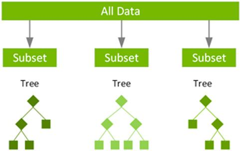

## 一、随机森林是什么，能干什么

**随机森林是一种机器学习算法。**

机器学习中有一种大类叫集成学习（Ensemble Learning），集成学习的基本思想就是将多个分类器组合，从而实现一个预测效果更好的集成分类器。集成算法可以说从一方面验证了中国的一句老话：三个臭皮匠，赛过诸葛亮。集成算法大致可以分为：Bagging，Boosting 和 Stacking 三大类型。

**随机森林既可以胜任分类任务又可以胜任回归任务。**

机器学习中有两种任务，回归和分类，而随机森林可以同时胜任这两种任务。其中分类任务是对离散值进行预测（比如将一景图像中的植被，建筑，水体等地物类型分类）；回归任务是对连续值进行预测（比如根据已有的数据预测明天的气温是多少度，预测明天某基金的价格）。

## 二、随机森林的思想

前面已经提到过，随机森林是属于集成学习，其核心思想就是集成多个弱分类器以达到三个臭皮匠赛过诸葛亮的效果。随机森林采用Bagging的思想，所谓的Bagging就是：

（1）每次有放回地从训练集中取出 n 个训练样本，组成新的训练集；

（2）利用新的训练集，训练得到M个子模型；

（3）对于分类问题，采用投票的方法，得票最多子模型的分类类别为最终的类别；对于回归问题，采用简单的平均方法得到预测值。

随机森林以决策树为基本单元，通过集成大量的决策树，就构成了随机森林。其构造过程如下：

**（1）构建单棵决策树。**

随机森林是多棵决策树的集成，决策树结构如下。

树的构建包括两个部分：样本和特征。

样本：对于一个总体训练集T，T中共有N个样本，每次有放回地随机选择N(因为有放回，所以虽然是N但是不可能遍历所有样本)个样本。这样选择好了的N个样本用来训练一个决策树。

特征：假设训练集的特征个数为d，每次仅选择k（k<d）个构建决策树。

下面开始构建决策树。

第一步：T中共有N个样本，有放回的随机选择N个样本。这选择好了的N个样本用来训练一个决策树，作为决策树根节点处的样本。

第二步：当每个样本有M个属性时，在决策树的每个节点需要分裂时，随机从这M个属性中选取出m个属性，满足条件m << M。然后从这m个属性中采用某种策略（比如说信息增益）来选择1个属性作为该节点的分裂属性。

第三步：决策树形成过程中每个节点都要按照步骤2来分裂，一直到不能够再分裂为止。注意整个决策树形成过程中没有进行剪枝。

第四步：按照步骤1~3建立大量的决策树，这样就构成了随机森林了。

**（2）产生最终结果。**

众多决策树构成了随机森林，每棵决策树都会有一个投票结果，最终投票结果最多的类别，就是最终的模型预测结果。

## 三、决策树的具体建立过程

上述只是从思想方面简单介绍了随机森林的建立，那么在细节方面随机森林是如何建立的呢，还得从决策树讲起。毕竟决策树才是基础。决策树也是一种算法，那么决策树是如何实现一个分类任务的呢？

### **3.1 树的结构**

* 树的物理结构

决策树是一种树形结构，由结点（node）[其中结点包括内部结点（internal note）和叶结点（leaf node）两种类型] 和 向边（directed edge）组成。

* 树的数学表述

可以将决策树看成是一个if-then规则的集合，根据规则，逐次判断条件，最终依据路径归于特定类别。其数学表示可以为给定特征条件下的条件概率分布。

图片来自《机器学习》周志华

图片来自《统计学习方法》李航

### **3.2 决策树的构建过程**

 **决策树的构建一般包含三个部分** ：特征选择、树的生成、剪枝。需要指出的是，树的生成是一个递归的过程。一般而言，随着划分过程不断进行，我们希望决策树的分支结点所包含的样 本尽可能属于同一类别，即结点的"纯度" (purity) 越来越高。剪枝则是为了增加模型的泛化能力，防止过拟合。

* （1）划分特征，也叫特征选择。

现在我们有了输入数据，并且输入的数据有自己的属性特征。那么决策要做的就是决定用那个特征来划分特征空间。比如有一个贷款申请数据集，该数据即有年龄和是否有工作两个属性，那么不同特征就能决定不同的决策树。决策树需要做到的就是确定该怎么选用特征。

那么决策树是如何选择特征的呢？下面介绍决策树选择特征的几个指标。

在介绍指标之前，需要引入熵的概念。在信息论与概率统计中，熵（entropy）是表示随机变量不确定性的度量，熵越大不确定越大，熵越小不确定性越小。即熵越小信息越纯（我们需要的就是纯粹和确定）。熵（信息熵）公式如下：

备注：熵和条件熵中的概率由数据估计得到时，所对应的熵与条件熵分别称为经验熵（empirical entropy）和经验条件熵（empirical conditional entripy）。

 **（1）信息增益（information gain）：** 表示得知特征X的信息而使得类Y的信息的不确定性减少的程度。一般而言，信息增益越大则意味着用属性 a 来进行划分所获得的“纯度提升”越大（信息增益越大越好）。其数学表述如下： **特征A对训练数据集D的信息增益 $g(D,A)$ ,定义为集合D的经验熵 $H(D)$ 与特征A给定条件下D的经验条件熵 $H(D|A)$ 之差** ，即

著名的ID3决策树学习算法就是以信息增益为准则来选择划分属性。但ID3算法只适用于分类任务中，且改算法生成的树容易产生过拟合（因为ID3只有树的生成没有剪枝）。

 **（2）信息增益比（information gain ratio），也称为增益率：** 信息增益的大小是相对训练数据集而言的，并没有绝对意义。在分类问题困难时，也就是说在训练数据即的经验熵大的时候，信息增益值会偏大，反之信息增益值会偏小。这就使得信息增益和熵之间的的初衷产生了矛盾。数学概念如下： **特征A对训练数据集D的信息增益 $g_R(D,A)$ ,定义为其信息增益$g(D,A)$*与训练数据集D的经验熵$H(D))$*之比。****

C4.5是对ID3算法的改进，C4.5算法采用信息增益比进行特征选择。

**（3）基尼指数（Gini index）：随机森林**使用“基尼指数”来选择划分属性。基尼指数越小，则数据集的纯度越高。

（4）袋外误差（oob error）：随机森林还可以使用袋外误差进行特征优选。袋外的概念就是我们一次对样本进行采样，假设总共有M个样本，一次采样只采集A个样本，那么就有M-A个样本没有被采集到，这些样本就是用来作为测试样本后期衡量决策树的好坏，当然也拿来衡量特征的好坏。

* （2）树的生成

不同决策树算法中树的生成存在差异，但一般而言都是一个递归的过程。

* （3）剪枝

决策树生成算法递归地产生决策树，知道不能继续下去位置。这样的产生的树往往度训练数据的分类很准确，但对位置的测试数据的分类却没有那么准确，即出现过拟合现象。过拟合的原因在于学习时过多的考虑如何提高对训练数据的正确分类，从而构建出过于复杂的决策树。

解决这个问题的办法就是考虑决策树的复杂对，对已生成的决策树进行简化，简化的过程称为剪枝。一些简单的剪枝算法包括损失函数（loss function）、代价函数（cost function）等。需要注意的是，决策树的剪枝算法可以由一种动态规划的算法实现。

## 四、随机森林的构建

### 4.1 分类与回归树

分类与回归树（classification and regression tree，CART）模型Breiman等在1984年提出的，是应用广泛的决策树学习方法。该方法可以应用于分类和回归。

CART假设决策树是二叉树，内部结点特征的取值为“是”和“否”，左边分支取值“是”，右边分支取值为“否”，这样的决策树等价于递归地二分每个特征。

CART算法由以两步组成决策树生成和决策树剪枝。：

（1）决策树生成：基于训练数据集生成决策树，生成的决策树要尽量大。

决策树的生成就是递归的构建二叉树的过程，对回归树用平方误差最小化准则，对分类树用基尼指数最小化准则，进行特征选择，生成二叉树。

* 回归树的生成

回归树的生成算法如下：

* 分类树的生成

分类树用基尼指数或袋外误差选择最优特征，同时决定该特征的最优二值切分点。基尼指数表示集合D的不确定性，基尼指数值越大，样本的不确定性越大，这一点和熵相似。

CART树生成算法如下：

（2）CART剪枝：用验证数据集对已生成的树进行剪枝并选择最优子树，这时用损失函数作为剪枝的标准。CART剪枝算法由两步组成：首选从算法产生的决策树底端不断剪枝，知道根节点，形成一个子树序列；然后通过交叉验证法在独立的验证数据集上对子序列进行测试，从中选择最优子树。

### 3.2 决策树和随机森林

多棵决策树构成了随机森林。每棵树都会产生一个结果，投票结果多的那类就是最后的分类结果
